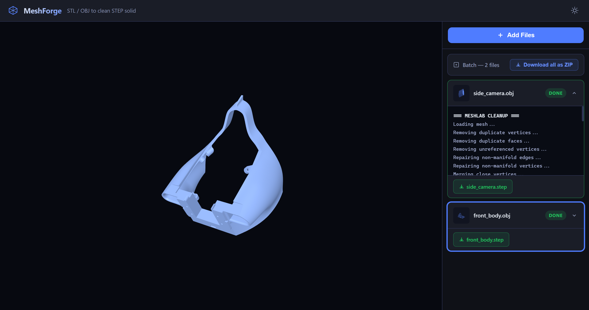

# MeshForge

Convert STL and OBJ mesh files into clean STEP solids — entirely in the browser, with a real-time progress feed and an interactive 3D preview.



## Features

- **Drag-and-drop upload** — drop one or more STL / OBJ files to queue them all at once
- **Real-time progress** — server-sent events stream each pipeline stage as it runs
- **3D preview** — interactive Three.js viewer opens when a job completes; click any finished job to inspect it
- **Batch download** — download individual STEP files or zip all completed jobs in one click
- **Dark / light theme** — persisted across sessions
- **Two-stage pipeline**
  1. PyMeshLab cleanup: removes duplicates, repairs non-manifold geometry, decimates oversized meshes, smooths
  2. pythonocc-core solid: sews the cleaned mesh into a closed STEP solid with geometry validation

## Quick Start — Docker

No local Python or Node.js installation required.

```bash
docker pull ghcr.io/<owner>/meshforge:latest
docker run --rm -p 5000:5000 ghcr.io/<owner>/meshforge:latest
```

Then open <http://localhost:5000> in your browser.

Job directories are ephemeral by default. To persist converted files across container restarts:

```bash
docker run --rm -p 5000:5000 \
  -v meshforge_jobs:/app/jobs \
  ghcr.io/<owner>/meshforge:latest
```

## Supported Formats

| Input  | Output  |
| ------ | ------- |
| `.stl` | `.step` |
| `.obj` | `.step` |

## Using the Interface

1. Click **Add Files** or drag files directly onto the page.
2. The upload modal accepts multiple files at once; drag-and-drop also works.
3. Each file becomes a job card showing live log output as the pipeline runs.
4. When a job finishes, click its card to open the 3D viewer, or click **Download** to save the STEP file.
5. Use the **Download All** button (appears once at least one job is done) to grab a zip of every completed output.
6. Navigating away or closing the tab cancels any queued jobs automatically.

## Pipeline Details

The conversion runs serially on a background thread so the server stays responsive during heavy mesh work.

**Stage 1 — PyMeshLab cleanup**

- Removes duplicate vertices and faces, unreferenced vertices
- Repairs non-manifold edges and vertices
- Merges close vertices (`MERGE_THRESHOLD = 0.0001`)
- Re-orients normals coherently
- Decimates meshes over 100 000 faces to keep STEP file size manageable
- Applies one pass of Laplacian smoothing

**Stage 2 — pythonocc-core solid**

- Sews the cleaned triangle soup into a closed shell (`TOLERANCE = 0.01 mm`)
- Promotes the shell to a solid and fixes orientation
- Runs three rounds of `ShapeUpgrade_UnifySameDomain` to merge coplanar faces
- Validates geometry with `BRepCheck_Analyzer`
- Exports as ISO 10303 STEP AP214

## License

[MIT](LICENSE)
